# IdleCycles

A naive take on TidalCycles in JS, guided by learning.

## Examples

- [cat](https://felixroos.github.io/idlecycles/#Y2F0KCdjeWFuJyUyQyUyMCdtYWdlbnRhJyUyQyd5ZWxsb3cnKQ==)
- [seq](https://felixroos.github.io/idlecycles/#c2VxKCdjeWFuJyUyQydtYWdlbnRhJyUyQyd5ZWxsb3cnKQ==)
- [seq > seq](https://felixroos.github.io/idlecycles/#c2VxKCdjeWFuJyUyQyUyMHNlcSgnbWFnZW50YSclMkMlMjAneWVsbG93Jykp)
- [3 vs 2](https://felixroos.github.io/idlecycles/#c2VxKHNlcSgnY3lhbiclMkMlMjAnbWFnZW50YSclMkMlMjAneWVsbG93JyklMkMlMjBzZXEoJ2N5YW4nJTJDJTIwJ21hZ2VudGEnKSk=)
- [fast](https://felixroos.github.io/idlecycles/#ZmFzdCgyMCUyQyUyMHNlcSgnY3lhbiclMkMlMjAneWVsbG93Jykp)
- [slow](https://felixroos.github.io/idlecycles/#c2xvdygyJTJDJTIwY2F0KCdjeWFuJyUyQyUyMCdtYWdlbnRhJykp)
- [stack](https://felixroos.github.io/idlecycles/#ZmFzdCg0JTJDJTIwc2VxKCdjeWFuJyUyQyUyMCclMjMwMDAwMDA1MCclMkMlMjBzdGFjaygnY3lhbiclMkMlMjAnJTIzMDAwMDAwNTAnKSkp)
- [patternified arg](https://felixroos.github.io/idlecycles/#c2VxKCdjeWFuJyUyQydtYWdlbnRhJyUyQyd5ZWxsb3cnKSUwQS5mYXN0KGNhdCgxJTJDMiUyQzMlMkM0JTJDNSUyQzYlMkM3JTJDOCkp)

## Tidal from Scratch

I've created this repo to understand the core of [TidalCycles](https://tidalcycles.org/) at a deeper level by re-implementing its core logic.
This part of the README will document my progress and could be helpful for people trying to understand tidal.
Disclaimer: This is not tidal, so take it with a grain of salt.

### Table Of Contents

1. [Patterns as Functions of Time](#chapter-1-patterns-as-functions-of-time)
2. [Adding more Functions](#chapter-2-adding-more-functions)
3. [Language Improvements](#chapter-3-language-improvements)
4. [Mini Notation Parsing](#chapter-4-mini-notation-parsing)

## Chapter 1: Patterns as Functions of Time

The core primitive of tidal are Patterns, which are essentially functions of time:

```ts
let silence = (a, b) => [];
silence(0, 1); // []
silence(42, 79); // []
```

The above example is the most simple pattern I can think of: silence. It will always return an empty Array. The inputs `a` and `b` are the timespan we want to know about.

### We love repetition

The above example doesn't really do much, so let's implement another pattern that repeats the same thing over and over:

```js
let repeat = (a, b) => {
  let bag = [];
  while (a < b) {
    bag.push({ a, b: a + 1, value: "X" });
    a++;
  }
  return bag;
};
repeat(0, 1); // [{a: 0, b: 1, value: 'X'}]
repeat(0, 2); // [{a: 0, b: 1, value: 'X'}, {a: 1, b: 2, value: 'X'}]
repeat(1, 3); // [{a: 1, b: 2, value: 'X'}, {a: 2, b: 3, value: 'X'}]
```

This function will give us one object per whole number within the given time span.
The object contains the timespan during it is active + some value.

### Higher Order Functions

Ideally, we'd want to choose the value to repeat, so let's make it a higher order function:

```js
let repeat = (value) => (a, b) => {
  let bag = [];
  while (a < b) {
    bag.push({ a, b: a + 1, value });
    a++;
  }
  return bag;
};
let snakes = repeat("snake");
let dogs = repeat("dog");
snakes(0, 2); // [{a: 0, b: 1, value: 'snake'},{a: 1, b: 2, value: 'snake'}]
dogs(1, 3); // [{a: 1, b: 2, value: 'dog'}, {a: 2, b: 3, value: 'dog'}]
```

Higher order just means we have a function that returns a function. The outer function takes a value and returns the inner function, which is a Pattern.

### It's Hap-pening

Our returned object could be expressed as a typescript type like this:

```ts
declare type Hap<T> = { a: number; b: number; value: T };
```

With these `Hap`'s, we can now define a Pattern like this:

```ts
declare type Pattern<T> = (a: number, b: number) => Hap<T>[];
```

Note that these typings are only a simplified version of what strudel or tidal use, but it's enough to get started thinking about Patterns.

### Conc-_cat_-enation

Our repeat function is still a bit boring.. How about switching between different values?

```js
let cat =
  (...values) =>
  (a, b) => {
    let bag = [];
    while (a < b) {
      const value = a % values.length;
      bag.push({ a, b: a + 1, value });
      a++;
    }
    return bag;
  };
let pat = cat("snake", "dog");
pat(0, 2); // [{a: 0, b: 1, value: 'snake'},{a: 1, b: 2, value: 'dog'}]
pat(1, 3); // [{a: 1, b: 2, value: 'dog'}, {a: 2, b: 3, value: 'snake'}]
```

The above pattern gives us an infinite timeline of snakes and dogs!

The implementation looks very similar to `repeat`, maybe we should generalize this loop:

```js
let cycle = (callback) => (a, b) => {
  let bag = [];
  while (a < b) {
    bag = bag.concat(callback(a, a + 1));
    a++;
  }
  return bag;
};

let repeat = (value) => cycle((a, b) => [{ a, b, value }]);

let cat = (...values) =>
  cycle((a, b) => {
    let value = values[a % values.length];
    return [{ a, b, value }];
  });
```

With this, we could implement `repeat` and `cat` much more concise!

### Patterns as Functions of Space

So far, I've talked about `a` and `b` as a _time_ span, but that's just a metaphor, because tidal is used for music (typically).
But it's actually just a numerical range, so nothing stops us from interpreting Patterns as functions of space:

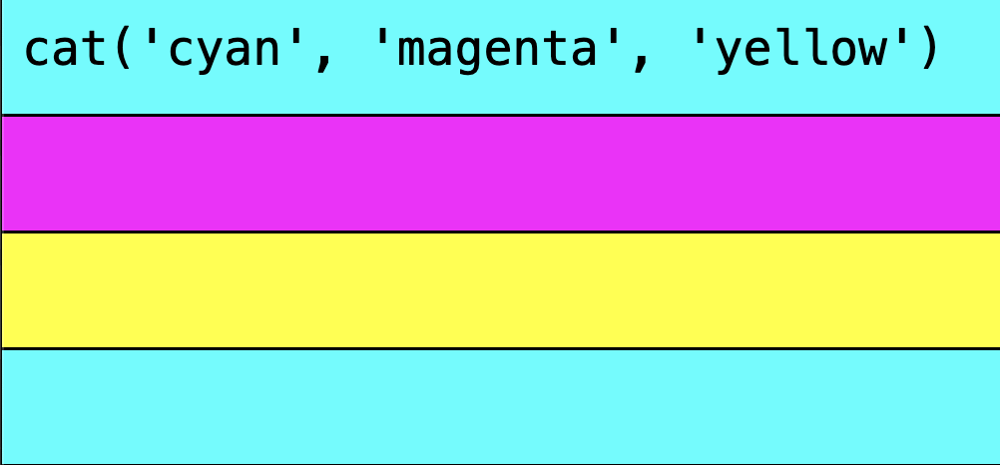

In this other kind of cat picture, we see each whole number cycle represented as a line, and the value of each `Hap` is interpreted as a color.

From now on, I'll use this type of visualization, as it makes more sense in a written guide.

### Chapter 1 REPL

This is the end of the first chapter!
I've decided to create a separate HTML file with the code for each chapter including a minimal REPL for you to play around with.

Open [chapter1.html](https://felixroos.github.io/idlecycles/learn/chapter1.html) to play with `cat` and `repeat`. You can evaluate the code with `ctrl+enter` to see the visualization in action!

Here are some examples:

- [cat](https://felixroos.github.io/idlecycles/learn/chapter1.html#Y2F0KCdjeWFuJyUyQyUyMCdtYWdlbnRhJyUyQyUyMCd5ZWxsb3cnKQ==)
- [repeat](https://felixroos.github.io/idlecycles/learn/chapter1.html#cmVwZWF0KCdjeWFuJyk=)

This might still not be very exciting, but we're on our way!

## Chapter 2: adding more functions

In this chapter we will take the previous primitives and create new useful functions.

### slow and fast

One interesting property about Patterns as functions of time (or space) is that we can edit the time span from the outside:

```js
let fast = (factor, pat) => (a, b) =>
  pat(
    a * factor, // scale up timespan
    b * factor
  ).map((hap) => ({
    a: hap.a / factor, // scale down hap timespan
    b: hap.b / factor,
    value: hap.value,
  }));

fast(5, cat("cyan", "magenta", "yellow"));
```

This will have the effect of scaling the time axis of our Haps. This is the visual representation:

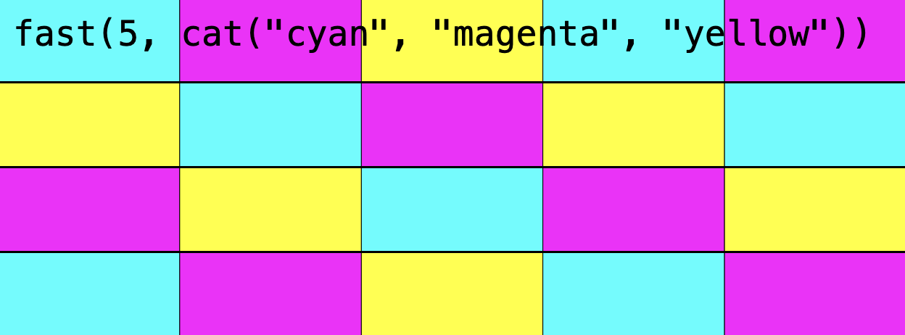

The trick is to first request scale up our timespan and then scale down the time span of each Hap by the given factor.

We can implement the opposite version of the function like this:

```js
let slow = (factor, pat) => fast(1 / factor, pat);
```

Example:

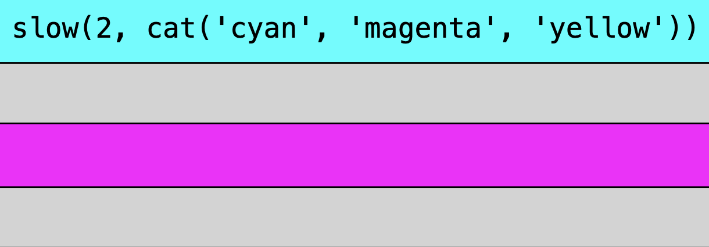

The fact that there are gray areas is due to the way the visual is implemented. Each Hap gets one rectangle whose width is determined by its timespan duration. In the above case, each colored rectangle is 2 screens wide, so you won't see half of it.
We could theoretically implement a split logic, where rectangles that are longer than one screen would be split and moved to the next line, but i guess this is fine for now..

### seq

Another useful function can be derived by combining `cat` and `fast`:

```js
let seq = (...values) => fast(values.length, cat(...values));
```

This function will squeeze its given values into a single cycle:

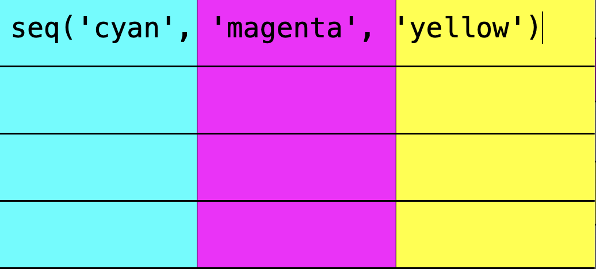

Here we can already see a cool property of functional programming: If we have a set of base functions, we can combine them declaratively to create new functions. You can think of it like crafting new materials from a set of raw materials.

### stack

The `stack` function will place all values in the same timespan:

```js
let stack = (...values) =>
  cycle((a, b) => values.map((value) => ({ a, b, value })));
```

Visually, we're in 2D, so stacked rectangles will end up in the same place.
This will only have a visual effect when the stacked colors are transparent:

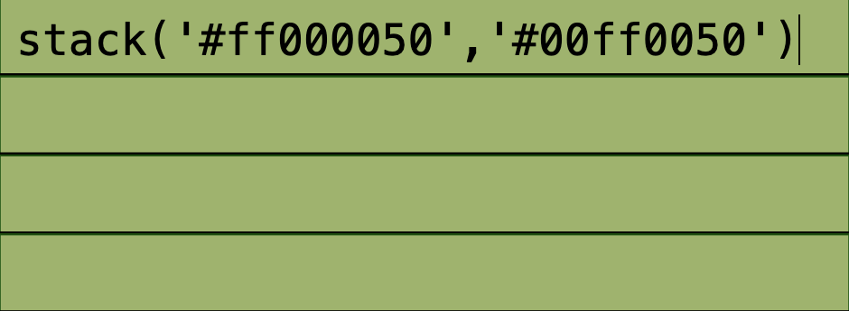

### Patterns of Patterns

Our standard library is growing, but we're still missing an important property of Patterns: the ability to nest Patterns inside of each other. Here's an example:

```js
cat("cyan", seq("magenta", "yellow"));
```

If we do that, we only get cyan, because the second input of `cat` is not a color (and the canvas API will resort to the last working color when drawing the rect of the second input).

We can fix it like this:

```js
let cat = (...values) =>
  cycle((a, b) => {
    let value = values[a % values.length];
    // if we have a function, we'll assume it's a Pattern function
    if (typeof value === "function") {
      return value(a, b);
    }
    // if it's not a function we'll take it as before
    return [{ a, b, value }];
  });
```

Now if a value is a function, we'll call it with the current cycle, assuming it's a Pattern function, which allows us to nest:

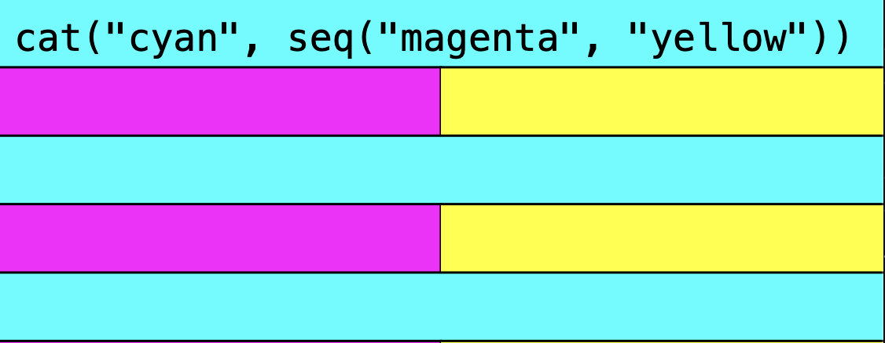

And magically, we can nest Patterns as deep as we like:

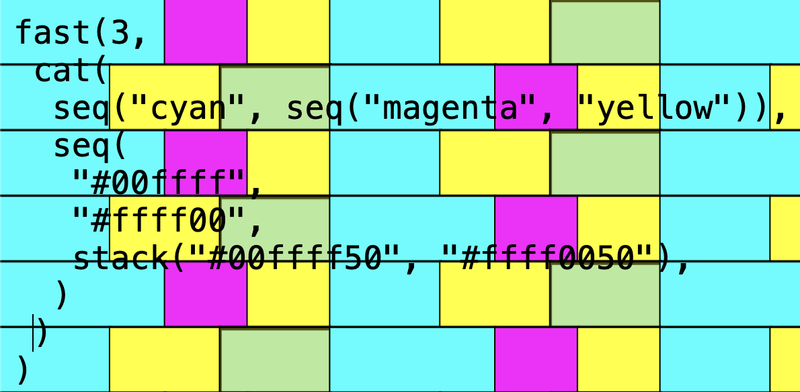

### Chapter 2 REPL

This is the end of the second chapter!

Open [chapter2.html](https://felixroos.github.io/idlecycles/learn/chapter2.html) to play with all the new functions. You can evaluate the code with `ctrl+enter` to see the visualization in action!

With these new functions, we can already create some non-trivial patterns, but the syntax is still a bit unwieldy, as it's difficult to keep track of all the parens when nesting.. Luckily, there is a way out, which we'll implement in the next chapter!

Examples:

- [fast](https://felixroos.github.io/idlecycles/learn/chapter2.html#ZmFzdCg1JTJDJTIwY2F0KCdjeWFuJyUyQyUyMCdtYWdlbnRhJyUyQyUyMCd5ZWxsb3cnKSk=)
- [slow](https://felixroos.github.io/idlecycles/learn/chapter2.html#c2xvdygyJTJDJTIwY2F0KCdjeWFuJyUyQyUyMCdtYWdlbnRhJyUyQyUyMCd5ZWxsb3cnKSk=)
- [seq](https://felixroos.github.io/idlecycles/learn/chapter2.html#c2VxKCdjeWFuJyUyQyUyMCdtYWdlbnRhJyUyQyUyMCd5ZWxsb3cnKQ==)
- [stack](https://felixroos.github.io/idlecycles/learn/chapter2.html#c3RhY2soJyUyM2ZmZmYwMDUwJyUyQyUyMCclMjMwMGZmZmY1MCcp)
- [cat with nested seq](https://felixroos.github.io/idlecycles/learn/chapter2.html#Y2F0KCdjeWFuJyUyQyUyMHNlcSgnbWFnZW50YSclMkMlMjAneWVsbG93Jykp)
- [deeper nesting](https://felixroos.github.io/idlecycles/learn/chapter2.html#ZmFzdCgzJTJDJTBBJTIwY2F0KCUwQSUyMCUyMHNlcSglMjJjeWFuJTIyJTJDJTIwc2VxKCUyMm1hZ2VudGElMjIlMkMlMjAlMjJ5ZWxsb3clMjIpKSUyQyUwQSUyMCUyMHNlcSglMEElMjAlMjAlMjAlMjAlMjIlMjMwMGZmZmY1MCUyMiUyQyUwQSUyMCUyMCUyMCUyMCUyMiUyM2ZmZmYwMDUwJTIyJTJDJTBBJTIwJTIwJTIwJTIwc3RhY2soJTIyJTIzMDBmZmZmNTAlMjIlMkMlMjIlMjNmZmZmMDA1MCUyMiklMEElMjAlMjApJTBBJTIwKSUwQSk=)

## Chapter 3: Language Improvements

Let's improve the language a bit. In strudel you can write:

```js
cat("cyan", "magenta", "yellow").fast(2);
// is equivalent to:
fast(2, cat("cyan", "magenta", "yellow"));
```

In our little implementation, we can only write the second variant.
To get to the first variant, `cat` needs to return an object, where `fast` is a property.

### Pattern as a class

We can refactor our existing code by introducing the `Pattern` class.

```js
class Pattern {
  constructor(query) {
    this.query = query;
  }
}
// Pattern creation shortcut:
let P = (q) => new Pattern(q);

Pattern.prototype.fast = function (speed) {
  return fast(speed, this);
};

Pattern.prototype.slow = function (speed) {
  return slow(speed, this);
};
```

This still won't work, because `fast` itself needs to return a `Pattern` instance + handle a `Pattern` as its input:

```js
let fast = (factor, pat) =>
  // the P(...) wraps our query function in a Pattern
  // + pat is now a Pattern, which has to queried by calling pat.query
  P((a, b) =>
    pat.query(a * factor, b * factor).map((hap) => ({
      a: hap.a / factor,
      b: hap.b / factor,
      value: hap.value,
    }))
  );
```

We're almost there, now the last refactoring to do is to make sure all the other functions return a `Pattern` instance, so we can call `.fast` and `.slow` on them.
Luckily, our `cycle` function is the only thing we need to touch:

```js
let cycle = (callback) =>
  P((a, b) => {
    // ^ the P(...) is new
    let bag = [];
    while (a < b) {
      bag = bag.concat(callback(a, a + 1));
      a++;
    }
    return bag;
  });
```

Finally, we can do:

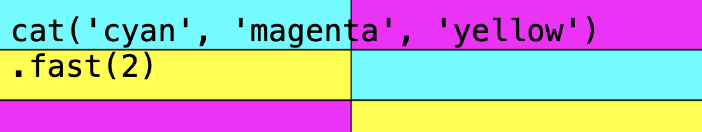

We need another little fix for nested Patterns:

```js
let cat = (...values) =>
  cycle((a, b) => {
    let value = values[a % values.length];
    if (value instanceof Pattern) {
      // ^ now we check if value is a Pattern instance
      return value.query(a, b);
    }
    return [{ a, b, value }];
  });
```

Before we were checking for value being a function..

### More Meta Programming

We have added our `fast` and `slow` methods to a `Pattern` by defining a function on `Pattern.prototype`.
Because we want to add many more functions that transform a `Pattern`, we can add a helper function to simplify that:

```js
let register = (name, fn) => {
  Pattern.prototype[name] = function (...args) {
    return fn(args, this);
  };
  return fn;
};

let fast = register("fast", (factor, pat) => /* ... */);
let slow = register("slow", (factor, pat) => fast(1 / factor, pat));
```

This paves the way for a lot more functions to come!

### lastOf / firstOf

Last but not least, let's add another set of functions:

```js
let firstOf = register("firstOf", (n, fn, pat) =>
  cycle((a, b) => (a % n === 0 ? fn(pat) : pat).query(a, b))
);
let lastOf = register("lastOf", (n, fn, pat) =>
  cycle((a, b) => (a % n === n - 1 ? fn(pat) : pat).query(a, b))
);
```

This allows us to conditionally apply a function every n cycles:

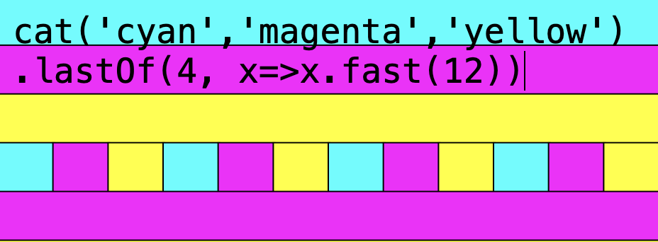

### Chapter 3 REPL

This is the end of the third chapter!

Open [chapter3.html](https://felixroos.github.io/idlecycles/learn/chapter2.html) to play with the new syntax. You can evaluate the code with `ctrl+enter` to see the visualization in action!

Examples

- [fast as a method](https://felixroos.github.io/idlecycles/learn/chapter3.html#Y2F0KCdjeWFuJyUyQyUyMCdtYWdlbnRhJyUyQyUyMCd5ZWxsb3cnKSUwQS5mYXN0KDUp)

## Chapter 4: Mini Notation Parsing

One very distinct feature of tidal is its mini notation. Let's build it from scratch! Most of the logic is heavily inspired by [A Compiler From Scratch](https://www.destroyallsoftware.com/screencasts/catalog/a-compiler-from-scratch).

### Our goal

We want to be able to write stuff like:

```js
mini("<cyan magenta [yellow white]>").fast(5);
// which is equivalent to
cat("cyan", "magenta", seq("yellow", "white")).fast(5);
```

To be able to do this, we need to parse the mini notation string and somehow construct the appropriate function calls.

### The Tokenizer

We start with a list of valid tokens, which are the smallest meaningful chunks our code can have:

```js
let token_types = {
  open_cat: /^\</, // "<"
  close_cat: /^\>/, // ">"
  open_seq: /^\[/, // "["
  close_seq: /^\]/, // "]"
  plain: /^[a-zA-Z0-9\.]+/, // values
};
```

This is a mapping from a human friendly token type to the regex that parses it.

With it, we can tokenize a string like this:

```js
function next_token(code) {
  for (let type in token_types) {
    const match = code.match(token_types[type]);
    if (match) {
      return { type, value: match[0] };
    }
  }
  throw new Error(`could not match "${code}"`);
}
next_token("<cyan magenta>"); // { type: "open_cat", value: "<" }
next_token("cyan magenta>"); // { type: "plain", value: "cyan" }
// ...
```

Now we can use that function repeatedly to tokenize a whole string:

```js
function tokenize(code) {
  let tokens = [];
  while (code.length > 0) {
    code = code.trim(); // trim white spaces
    const token = next_token(code);
    code = code.slice(token.value.length);
    tokens.push(token);
  }
  return tokens;
}
tokenize("<cyan magenta>");
/* [
{ type: "open_cat", value: "<" },
{ type: "plain", value: "cyan" },
{ type: "plain", value: "magenta" },
 { type: "close_cat", value: ">" },
] */
```

Here, we are taking token by token out of the string, until it is empty.
That's already a fine tokenizer, let's move on to the parser!

### The Parser

After the code has been tokenized, we can construct a tree. Mini notation supports arbitrary levels of nesting, so we want to support stuff like `<cyan [magenta [white black] yellow]>`. For this example we'd expect something like:

```json
{
  "type": "cat",
  "args": [
    { "type": "plain", "value": "cyan" },
    {
      "type": "seq",
      "args": [
        { "type": "plain", "value": "magenta" },
        {
          "type": "seq",
          "args": [
            { "type": "plain", "value": "white" },
            { "type": "plain", "value": "black" }
          ]
        },
        { "type": "plain", "value": "yellow" }
      ]
    }
  ]
}
```

This might look impossible at first, but it's very doable with some sprinkles of recursion.

Let's start by defining a Parser that is really dumb:

```js
class Parser {
  // take code, return tree
  parse(code) {
    this.tokens = tokenize(code);
    return this.parse_cat();
  }
  // parse_cat (wip)
  parse_cat() {
    this.consume("open_cat");
    const a = this.consume("plain");
    const b = this.consume("plain");
    this.consume("close_cat");
    return { type: "cat", args: [a, b] };
  }
  consume(type) {
    // shift removes first element and returns it
    const token = this.tokens.shift();
    if (token.type !== type) {
      throw new Error(`expected token type ${type}, got ${token.type}`);
    }
    return token;
  }
}
new Parser().parse("<cyan magenta>");
```

The last line will return

```json
{
  "type": "cat",
  "args": [
    {
      "type": "plain",
      "value": "cyan"
    },
    {
      "type": "plain",
      "value": "magenta"
    }
  ]
}
```

... which is exactly what we want! The problem is that the parser can only parse `cat` with exactly 2 plain values... When we try:

```js
new Parser().parse("<cyan magenta white>");
```

.. we get `expected token type close_cat, got plain`, because we have 3 plain values. To match an arbitrary number of values, we can do this:

```js
class Parser {
  /* .. */
  parse_cat() {
    this.consume("open_cat");
    let args = [];
    while (this.tokens[0]?.type !== "close_cat") {
      args.push(this.consume("plain"));
    }
    this.consume("close_cat");
    return { type: "cat", args };
  }
}
// all of these work now:
new Parser().parse("<cyan magenta white>");
new Parser().parse("<cyan magenta>");
new Parser().parse("<cyan magenta brown red>");
```

A similar function can be implemented for `seq`:

```js
class Parser {
  /* .. */
  parse(code) {
    this.tokens = tokenize(code);
    return this.parse_seq();
  }
  parse_seq() {
    this.consume("open_seq");
    let args = [];
    while (this.tokens[0]?.type !== "close_seq") {
      args.push(this.consume("plain"));
    }
    this.consume("close_seq");
    return { type: "seq", args };
  }
}
new Parser().parse("[cyan magenta white]");
```

This smells like we could use an abstraction:

```js
class Parser {
  /* .. */
  parse_args(close_type) {
    const args = [];
    while (this.tokens[0]?.type !== close_type) {
      args.push(this.consume("plain"));
    }
    return args;
  }
  parse_seq() {
    this.consume("open_seq");
    const args = this.parse_args("close_seq");
    this.consume("close_seq");
    return { type: "seq", args };
  }
  parse_cat() {
    this.consume("open_cat");
    const args = this.parse_args("close_cat");
    this.consume("close_cat");
    return { type: "cat", args };
  }
}
```

We can now tie both functions together with a function that can parse any expression:

```js
class Parser {
  /* .. */
  parse(code) {
    this.tokens = tokenize(code);
    return this.parse_expr();
  }
  parse_expr() {
    let next = this.tokens[0]?.type;
    if (next === "open_cat") {
      return this.parse_cat();
    }
    if (next === "open_seq") {
      return this.parse_seq();
    }
    if (next === "plain") {
      return this.consume("plain");
    }
    throw new Error(`unexpected token "${this.tokens[0].value}"`);
  }
  parse_args(close_type) {
    const args = [];
    while (this.tokens[0]?.type !== close_type) {
      args.push(parse_expr()); // <-- use it here as well!
    }
    return args;
  }
}
// this now actually works:
new Parser().parse("<cyan [magenta [white black] yellow]>");
```

That's already a basic version of our parser!

### From a Tree to a Pattern

Now having a tree that represents the layers of nesting in our syntax, the last step is to convert it into pattern function calls:

```js
function patternifyTree(tree) {
  if (tree.type === "cat") {
    const args = tree.args.map((arg) => patternifyTree(arg));
    return cat(...args);
  }
  if (tree.type === "seq") {
    const args = tree.args.map((arg) => patternifyTree(arg));
    return seq(...args);
  }
  if (tree.type === "plain") {
    return tree.value;
  }
}
```

This is all we need! Now we can tie the whole thing together and call it a day:

```js
const parser = new Parser();
let mini = (code) => {
  const tree = parser.parse(code);
  const pat = patternifyTree(tree);
  if (pat instanceof Pattern) {
    return pat;
  }
  return repeat(pat); // repeat plain values
};
mini("<cyan [magenta white]>");
// = cat("cyan", seq("magenta", "white"))
```

And that's a basic implementation of the mini notation! It certainly doesn't cover all features, but it should give you the basic idea.

## Chapter 5: Operating on Values

Up until now, our functions to modify a pattern were very much concerned with the timespan. Let's look at ways to modify the value of a Hap.

### withValue

```js
let withHap = register("withHap", (fn, pat) =>
  P((a, b) => pat.query(a, b).map(fn))
);
let withValue = register("withValue", (fn, pat) =>
  pat.withHap((hap) => ({ ...hap, value: fn(hap.value) }))
);
```

The function `withHap` lets us edit a hap as we like. `withValue` uses it to run a function on the Hap value specifically, returning a new Hap.

With that, we could put together different shades of blue:

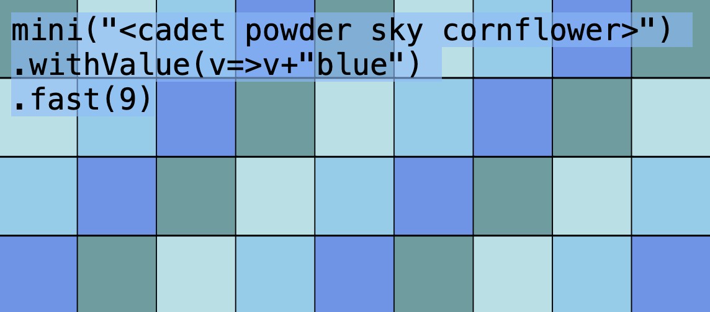

### Color from Numbers

Operating on values gets more exciting when we have numbers to work with. For that matter, let's update the draw logic that sets the rectangle color:

```js
if (isNaN(Number(value))) {
  ctx.fillStyle = value; // <- like before
} else {
  value = Number(value);
  ctx.fillStyle = `hsl(${value}turn 50% 50%)`;
}
```

Now, if we receive a valid number, we'll use it as the `hue` value in an `hsl` color!
Here's a rainbow:

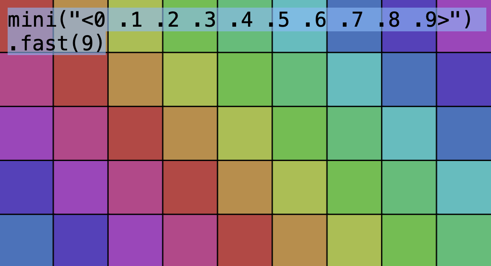

### Arithmetic

Now that we have numbers, we can do some arithmetic!

```js
let add = register("add", (n, pat) => pat.withValue((v) => v + n));
let sub = register("sub", (n, pat) => pat.withValue((v) => v - n));
let mul = register("mul", (n, pat) => pat.withValue((v) => v * n));
let div = register("div", (n, pat) => pat.withValue((v) => v / n));
let mod = register("mod", (n, pat) => pat.withValue((v) => v % n));
```

Using `add` and `mod`, we could rotate the color palette:

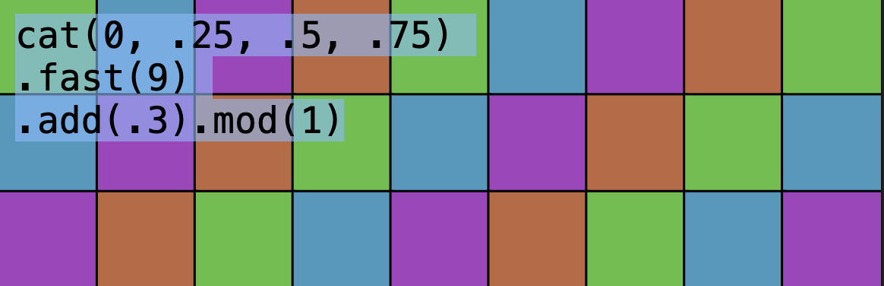

..changing the value of `add`:

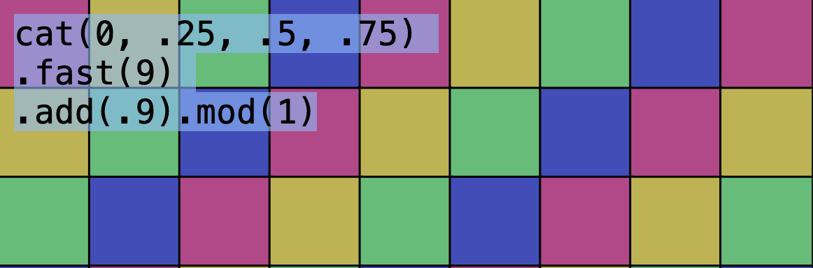

### Object as Values

Right now, we are only able to pattern the hue. Wouldn't it be nice if we could pattern other properties separately, like hue, saturation, lightness, transparency, rect size, ...? We can do this by adjusting our draw code again:

```js
const haps = pat.query(0, cycles);
haps.forEach(({ a, b, value }) => {
  let { color, h: hue, s: saturation, l: lightness, a: alpha } = value;
  let fillStyle;
  if (color) {
    fillStyle = color;
  }
  if (hue !== undefined) {
    hue = hue * 360;
    saturation = (saturation ?? 0.5) * 100;
    lightness = (lightness ?? 0.5) * 100;
    alpha = alpha ?? 1;
    fillStyle = `hsla(${hue},${saturation}%,${lightness}%,${alpha})`;
    console.log("fillStyle", fillStyle);
  }
  ctx.fillStyle = fillStyle;
});
```

With that in place, our patterns now need to contain objects:

```js
cat(
  { color: "yellow" },
  { h: 0.5, s: 0 },
  { h: 0.5, s: 0.25 },
  { h: 0.5, s: 0.5 },
  { h: 0.5, s: 0.75 },
  { h: 0.5, s: 1 }
).fast(7);
```

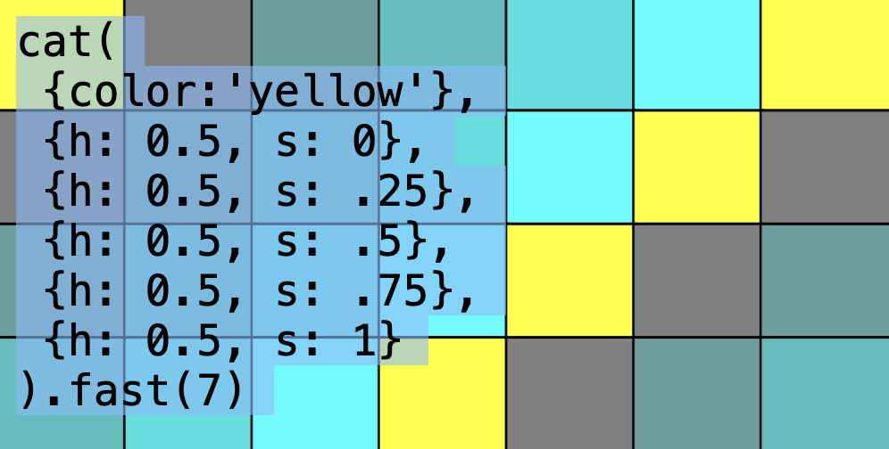

This notation is rather clunky, we need control functions to the rescue!

### Control Functions

A `control` is basically a shortcut to get a pattern of objects, which means each `Hap` has an object as value.

```js
let control = (name) =>
  register(name, (value, pat) => {
    if (pat) {
      // e.g. s(.5).h(.1) === h(.1, s(.5))
      return pat.withValue((v) => Object.assign(v, { [name]: value }));
    }
    // e.g. h(cat(.1, .2, .3))
    if (value instanceof Pattern) {
      return value.withValue((v) => ({ [name]: v }));
    }
    // e.g. h(.3)
    return repeat({ [name]: value });
  });

let color = control("color");
let h = control("h");
let s = control("s");
let l = control("l");
let a = control("a");
```

Controls are special in the sense that they can be used to create a pattern but also modify a pattern. This allows us to completely avoid curly braces `{}` and keep using functions with method chaining for object values.

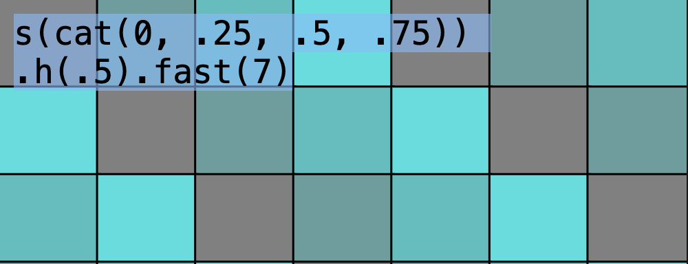

### Implicit Mini Notation

In Chapter 4, we've implemented mini notation. We can modify the register function to treat any string as mini notation like this:

```js
let register = (name, fn) => {
  let q = (...args) => {
    args = args.map((arg) => {
      if (typeof arg === "string") {
        return mini(arg);
      }
      return arg;
    });
    return fn(...args);
  };
  Pattern.prototype[name] = function (...args) {
    return q(...args, this);
  };
  return q;
};
```

Now we can set our controls with mini notation:

```js
s("<0 .25 .5 .75>").h(0.5).fast(7);
```

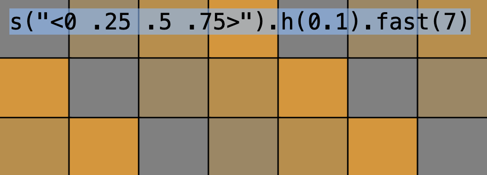

### End of Chapter 5

This is starting to look very usable!
In the next chapter we will see how we can join multiple Patterns into one, making our language much more expressive.

## To be continued
